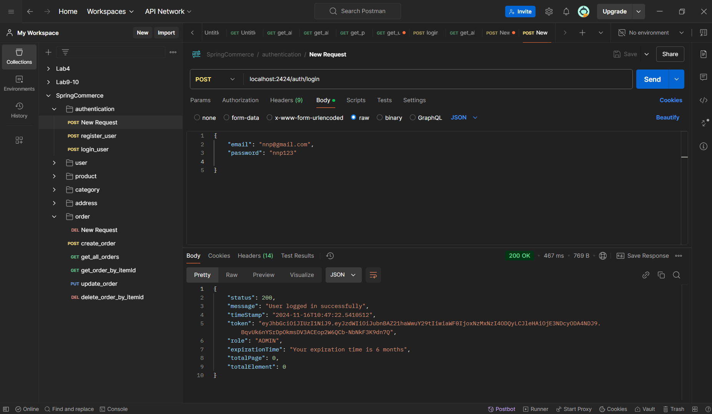
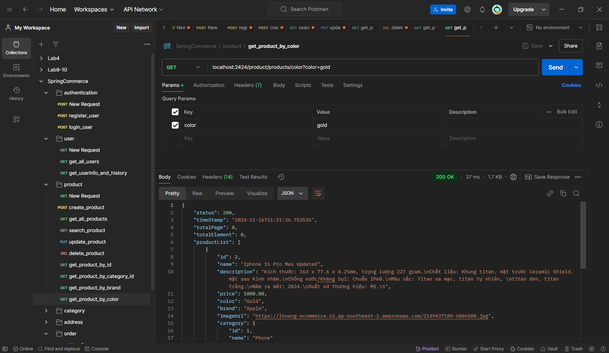
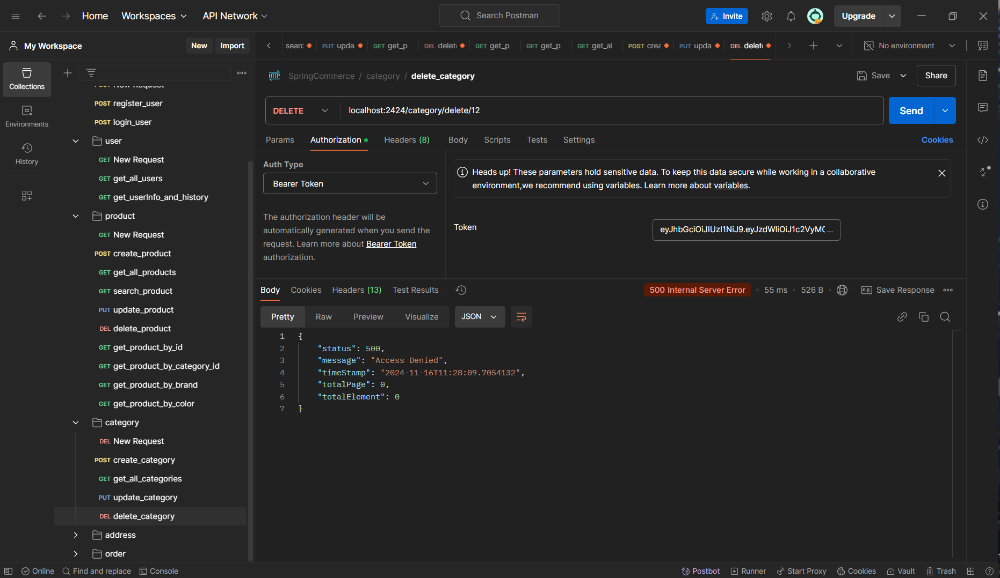

# Spring Commerce

SpringCommerce is an e-commerce project built with Spring Boot, providing RESTful APIs for managing products, orders, and users. This project applies software development principles, design patterns, and best practices to ensure the code is maintainable, scalable, and reusable.

## Software Development Principles
- **Maintainability, Scalability, and Reusability**:
    - The project is designed to be easily maintained and extended, reducing potential issues when adding new features or making changes.

- **Dependency Injection**:
    - Dependencies between classes are injected externally via the Spring Framework, reducing tight coupling and enhancing testability.

- **Code Reusability**:
    - The project encourages reusing code to minimize duplication and ensure consistency across the application.

## Software Development Patterns

- **RESTful Architecture**:
    - The project uses a RESTful architecture for client-server communication, utilizing HTTP methods such as GET, POST, PUT, and DELETE to manage resources like products and orders.

## Software Development Practices
- **Agile Methodology**:
    - The development process is broken down into short iterations, allowing for quick feedback from users and iterative adjustments throughout the development lifecycle.

## Code Structure

The project follows a layered architecture and employs best practices in organizing the code:

### Back-end:
- Framework: The application is built using the **Spring Boot** framework
- **RESTful API**
- **Main Folders and Components:**
    - Controller: 
        - Contains classes responsible for handling client requests.
        - These classes interact with the service layer to process data and return appropriate responses to the client.
        - Containing: `ProductController.java`, `OrderItemController.java`, `UserController.java`, `CategoryController`, `AuthenticationController`, `AddressController`.

    - DTO (Data Transfer Object):
        - Used to transfer data between layers (usually between the controller and client).
        - These classes are lightweight and often contain only the necessary fields needed for communication.
        - Containing: `ProductDTO.java`, `OrderDTO.java`, `UserDTO.java`, `OrderItemDTO`,...

    - Entity: 
        - Represents the data model of the application.
        - These classes are mapped to database tables using JPA (Java Persistence API).
        - Containing: `Product.java`, `Order.java`, `User.java`, `Category.java`, `OrderItem.java`, `Address.java`.
    
    - Enums:
        - Contains enumerations used throughout the application to represent fixed sets of values.
        - Containing: `OrderStatus.java`, `UserRole.java`.

    - Exception:
      - Includes custom exception classes to handle errors and provide meaningful messages to the client.
      - Containing: `GlobalExceptionHandler.java`, `InvalidCredentialException.java`, `NotFoundException.java`.

    - Mapper: 
      - Contains classes responsible for mapping between entities, DTOs, and other objects.
      - These mappers convert data from one format to another for easier communication between layers.
      - Containing: `EntityDTOMapper.java`.

    - Repository:
        - Contains interfaces for data access, extending `JpaRepository`to provide basic CRUD operations and other operations.
        - Containing: `ProductRepository.java`, `OrderRepository.java`, `UserRepository.java`, `OrderItemRepository.java`, `AddressRepository.java`, `CategoryRepository.java`.

    - Security: 
        - Includes configurations related to application security, such as JWT authentication, user authorization, and role-based access control.
        - Containing: `SecurityConfiguration.java`, `JwtUtils.java`, `JwtAuthenticationFilter.java`, `CustomUserDetailsService.java`, `CorsConfiguration.java`, `AuthenticationUser.java`.
    
    - Service:
        - Contains service **interfaces** and their **implementations**. The service layer holds business logic and calls the repository layer for data access.
        - The service layer provides abstraction for the controller layer and is easier to maintain and extend.
        - Containing: `ProductService.java`, `OrderItemService.java`, `UserService.java`,... and their implementations  `ProductServiceImpl.java`, `UserServiceImpl.java`, `OrderItemServiceImpl.java`,...
    
    - Specification:
        - Used for dynamic queries in the repository layer. It allows flexible querying using JPA Criteria API.
        - Containing: `OrderItemSpecification.java`.
##  All required steps in order to get the application run on a local computer

- **Clone the Repository**  
    - Clone the project to your local machine using the following commands:  
       ```bash
       git clone https://github.com/LMHoang-3003/SpringCommerce.git
       cd SpringCommerce
       ```
   - Install dependencies:
     ```bash
     mvn clean install
     ```
  - Configure the application:
    - Open src/main/resources/application.properties and set up your database configuration.
    - In this project it will be like this:
    ```bash
    spring.datasource.url=jdbc:mysql://localhost:3306/spring_commerce
    spring.datasource.username=your_database_username
    spring.datasource.password=your_database_password
    spring.datasource.driver-class-name=com.mysql.cj.jdbc.Driver
    server.port = 2424
    spring.jpa.hibernate.ddl-auto=update
    aws.s3.access=${AWS_ACCESS_KEY_ID}
    aws.s3.secrete=${AWS_SECRET_ACCESS_KEY}
    ```
  - Run the application:
    - Start the Spring Boot application using Maven:
    ```bash
    mvn spring-boot:run
    ```
## Full CURL commands or Postman snapshots to verify the APIs including request endpoints, HTTP Headers and request payload if any.
- Authentication:
  - User Login:
    
  - User Register:
    
- User:
  - Get all users:
    
  - Get user's information and history order:
    
    
    
- Product:
  - Create Product:
    
    
  - Get all Products:
    
    
  - Get product by id:
    
  - Get product by category id:
    
  - Get product by brand:
    
  - Get product by color:
    
    
  - Search Products by keyword:
    
    
    
  - Update Product:
    
    
    
  - Delete Product:
    
    
- Category:
  - Create category:
    
    
  - Get all categories:
    
  - Update category:
    
    
    
  - Delete category:
    
    
    
- Address:
  - Create or Update user's address:
    
    
- Order:
  - Create order:
    
  - Get all orders:
    
    
    
  - Get order by item id:
    
    
  - Udate order'status:
    
    
    

- Link video demo:
- [SpringCommerce](https://drive.google.com/file/d/1qp_v8_zXK_QssI3-zFbp7kbVlTQMBHN5/view?usp=sharing)
